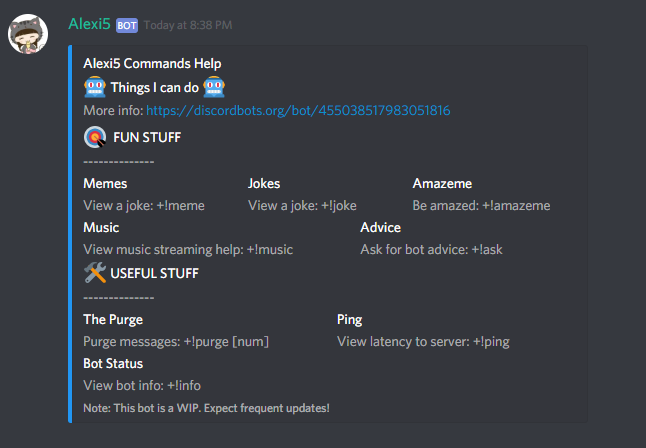

# Alexi5
##### Pronounced Alexi(s)

Alexi5 is a basic Discord bot built using discord.js

### **Features**
 #### Youtube Music Steaming
 Queue up YouTube music videos and stream the audio to a voice channel. Youtube playlists are also supported.
 #### Dank Memes
 What would a server be without memes. Get the dankest memes on your server.
#### Jokes
Nobody uses that feature but whatever.
#### Amazeme
Used to be amazed.
#### Server Cleanup
Clear messages cluttering your server in bulk. 

and more...

### Installation
* clone this repo
* Create a new app here: https://discordapp.com/developers/applications/me
* Paste the bot token in your `config.json` 
* Get a YouTube Api key from [here](https://console.developers.google.com/apis/credentials?project=_) and paste it in your `config.json`
* Optionally you can set your custom bot prefix in `config.json`
* run `npm install` to install the bot dependencies
* start the bot locally using `node index`

#### To invite the bot to your server simply replace the client id in the link below with the one generated through Discord's App dashboard and click on it

https://discordapp.com/oauth2/authorize?&client_id=YOUR_CLIENT_ID_HERE&scope=bot&permissions=0

### **Some Basic Commands**
* `[prefix]`**info**: Some basic info about the bot
* `[prefix]`**help**: List some helpful commands
* `[prefix]`**music**: Lists all music commands
* `[prefix]`**ping**: Returns api and bot reponse times
* `[prefix]`**meme**: Returns a random meme
* `[prefix]`**joke**: Returns a random joke
* `[prefix]`**amazeme**: Returns a random thing that is interesting.
* `[prefix]`**purge** [num]: Removes `num` messages from server

