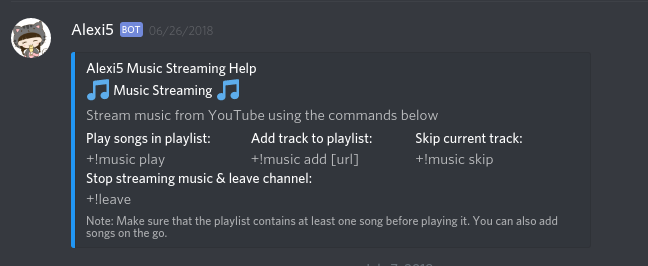

# Alexi5
##### Pronounced Alexi(s)

Alexi5 is a basic Discord bot built using discord.js

### Features
* **Youtube Music Steaming** - Queue up YouTube videos and stream the audio in a voice channel. Supports playlists as well.
* **memes** - What would a server be without memes.
* **jokes**  - Nobody uses that feature but whatever.
* **amazeme** - Displays amazing things.
* **server cleanup** - Remove messages in bulk.

### Installation
* Clone this repo
* Run `npm install` to install the bot dependencies
* Create a new app here: https://discordapp.com/developers/applications/me. 
This will generate a random bot token for you. You will need this for the bot to work
*  Create a .env file in the root directory with the following environment variables:
```
BOT_TOKEN=bot_token_here 
BOT_PREFIX=bot_prefix_here
```
* Replace `bot_token_here` with the generated token and `bot_prefix_here` with a prefix of your liking, 
eg `+!`
* `cd` into working directory
* Start the bot locally using `node alexi5`

#### To invite the bot to your server simply replace the client id in the link below with the one generated through Discord's App dashboard(Found in App Details section) and click on it

https://discordapp.com/oauth2/authorize?&client_id=YOUR_CLIENT_ID_HERE&scope=bot&permissions=0


### Basic Commands
* [prefix]help: List some helpful commands
* [prefix]music: Lists all music commands
* [prefix]ping: Returns api and bot reponse times
* [prefix]meme: Returns a random meme
* [prefix]joke: Returns a random joke
* [prefix]amazeme: Returns a random thing that is amazing.
* [prefix]purge [num]: Removes `num` messages from server
* NFSW commands ommitted



